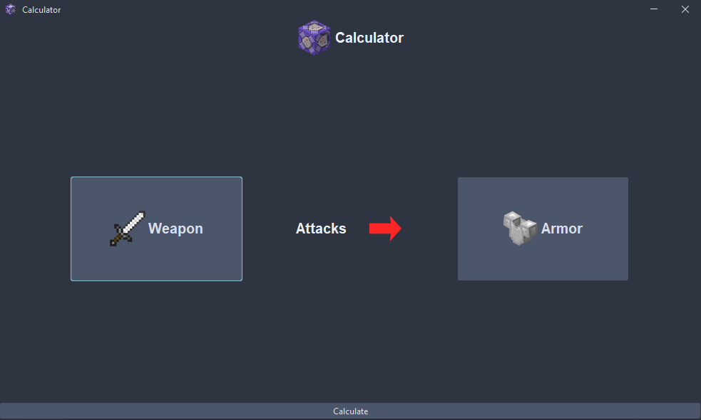

# 1.1 Modularbeit226b Overview
## Contents

```
1.1 Overview 
1.2 Introduction
1.3 How to use 
1.4 How to Install
1.5 Features We may add
```
# 1.2 Introduction
This project is a Minecraft damage calculator. Written in Java for a school project. There is a docs folder with school related documents (german).

# 1.3 How to use
Choose Weapon, Shaprness level as well as armor and protection level. Press calculate, and the program will show you the exact amount of damage.



# 1.4 How to Install

Download the latest Release and execute it with this command:
```
java -jar [filename].jar
```


# 1.5 Feature we may add
- [ ] Diffrent armor types
- [ ] axes
- [ ] potion effects
- [ ] more damage details


###### Overview written by Aron Baur
